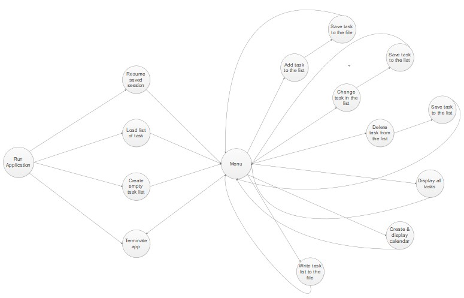

## Task Manager

Here's my first project maded according to standards of perfomance 1st Lab's project from Netcracker's course "Java programming language".

This application was built based on MVC pattern, so this project consists of three packages:
1. Model package - holds the data and prepeares it based on controller's instructions (actions).
2. View package - displays data to user in the console window.
3. Controller package - takes in user commands (inputs), sends them to the model to perform some operations.
4. Finally, class App - that run this app.

For storage the list of tasks, the application uses ArrayList that can be saved into json file after each actions (adding, changing or deleting task).

The principle of operation for the application is shown on below picture.

There're bat file that allow to *build* the project and also to run the jar file of main class.

# NOTE! 
That at first user can't have the json file, so if the user choose continue work the program will create the default empty file *test_manager.json* in *temp_test* folder, or try to read from the file *test_manager.json* and it doesn't exist, app will create it. And finally when user types date that must fit with mask like this *2020-02-18 20:14* orthewise the user shall repeat the input, but this mask (format) can always be changed anytime into *2020-02-18* or other types. 
# P.S
Also, the user can always read the log files that store in *logs* folder.